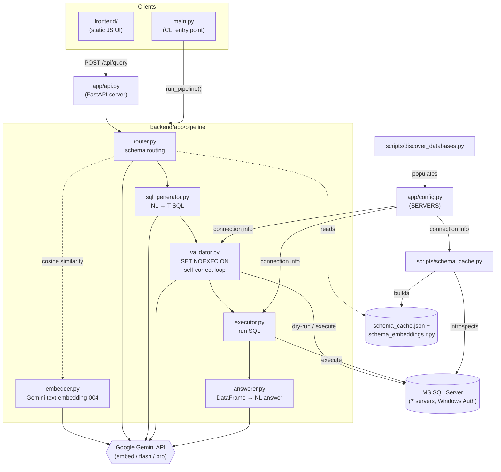

# NL2SQL

Natural language to SQL pipeline for Microsoft SQL Server. Ask a question in plain English, get an answer backed by your actual data.

## How it works

```
Question → Embed → Schema Route → Generate SQL → Validate & Self-Correct → Execute → Answer
```

1. **Embed** — converts the question into a vector using Gemini `text-embedding-004`
2. **Schema Route** — scores all tables by cosine similarity, then asks Gemini Flash to pick the relevant server/database/tables
3. **Generate SQL** — Gemini Pro writes T-SQL from the selected schema (presented as DDL)
4. **Validate & Self-Correct** — runs `SET NOEXEC ON` against the real database to catch schema errors; sends failures back to the LLM for correction (up to 3 attempts)
5. **Execute** — runs the validated SQL and returns a pandas DataFrame
6. **Answer** — Gemini Flash converts the results into a plain-English response

## Architecture



## Project structure

```
NL2SQL/
├── backend/
│   ├── app/
│   │   ├── config.py           # SQL Server connection config (7 servers)
│   │   ├── models.py           # shared dataclasses (pipeline contracts)
│   │   ├── prompts.py          # all LLM prompt templates
│   │   └── pipeline/
│   │       ├── embedder.py     # Gemini text-embedding-004 wrapper
│   │       ├── router.py       # embedding pre-filter + LLM schema routing
│   │       ├── sql_generator.py# NL → T-SQL via Gemini Pro
│   │       ├── validator.py    # SET NOEXEC ON dry-run + correction loop
│   │       ├── executor.py     # SQL execution → pandas DataFrame
│   │       └── answerer.py     # DataFrame → natural language answer
│   ├── scripts/
│   │   ├── discover_databases.py  # connect to servers and populate config
│   │   └── schema_cache.py        # introspect schema, build embedding index
│   ├── env_loader.py           # minimal .env loader (no extra deps)
│   ├── main.py                 # CLI entry point
│   └── requirements.txt
├── frontend/                   # future web UI
├── .env                        # gitignored — put your API key here
└── .gitignore
```

## Setup

### Requirements

- Python 3.11+
- [ODBC Driver 18 for SQL Server](https://learn.microsoft.com/en-us/sql/connect/odbc/download-odbc-driver-for-sql-server) (Windows, system-level install)
- Access to the Windows RDP machine with domain credentials (Windows Authentication via Duo MFA)
- A Google API key with Gemini access

### Install

```bash
cd backend
pip install -r requirements.txt
```

### Configure

Add your Google API key to `.env` at the repo root:

```
GOOGLE_API_KEY=your-key-here
```

### First-time setup (run on the Windows RDP machine)

**Step 1 — Discover databases**

Connects to each server and populates the `databases` lists in `app/config.py`:

```bash
cd backend
python scripts/discover_databases.py          # interactive
python scripts/discover_databases.py --all    # accept everything
python scripts/discover_databases.py --dry-run  # preview only
```

**Step 2 — Build the schema cache**

Introspects all configured databases and creates the embedding index:

```bash
python scripts/schema_cache.py
```

This produces `schema_cache.json` and `schema_embeddings.npy` in the `scripts/` folder. Re-run whenever the database schema changes.

### Run

```bash
cd backend
python main.py "what are the top 10 customers by total revenue this year?"
```

Or interactive mode:

```bash
python main.py
Question: <type your question>
```

## Authentication

All SQL Server connections use **Windows Authentication** (`Trusted_Connection=yes`). No credentials are stored in code or config. You must run the pipeline from the Windows RDP machine where your domain session is active (authenticated via Duo MFA).

## Configuration

Servers are defined in `backend/app/config.py`:

```python
SERVERS = {
    "dataTM1":      ServerConfig(host="dataTM1",        databases=["MyDB"]),
    "sqlProd1":     ServerConfig(host="sqlProd1",        databases=["SalesDB"]),
    "sqlProd1_org": ServerConfig(host=r"sqlProd1\org",  databases=["OrgDB"]),
    # ...
}
```

Named instances (e.g. `sqlProd1\org`) omit the port so SQL Server Browser resolves it dynamically.

## Models used

| Stage | Model | Why |
|---|---|---|
| Embedding | `text-embedding-004` | 768-dim, optimized for retrieval |
| Schema routing | `gemini-2.5-flash` | cheap classification, temp=0 |
| SQL generation | `gemini-2.5-pro` | best reasoning for complex T-SQL |
| SQL correction | `gemini-2.5-pro` | same model sees the error and fixes it |
| NL answer | `gemini-2.5-flash` | summarisation doesn't need Pro |

## Dependencies

| Package | Purpose |
|---|---|
| `google-genai` | Gemini LLM + embeddings |
| `pyodbc` | SQL Server ODBC driver bridge |
| `vanna` | `MSSQLRunner` for SQL execution |
| `pandas` | query results as DataFrames |
| `numpy` | cosine similarity over embedding matrix |
| `sqlparse` | pre-flight SQL statement type check |
| `tabulate` | DataFrame markdown formatting |
