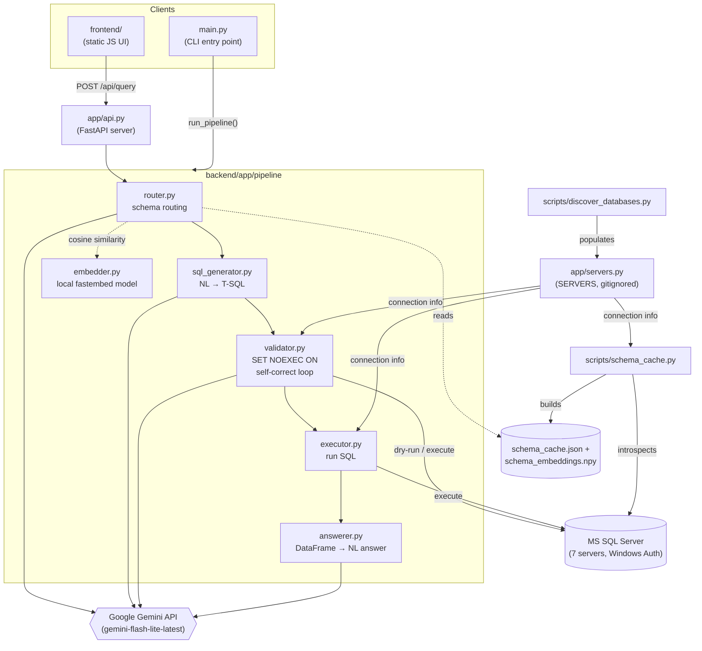

# NL2SQL

Natural language to SQL pipeline for Microsoft SQL Server. Ask a question in plain English, get an answer backed by your actual data.

## How it works

```
Question → Embed → Schema Route → Generate SQL → Validate & Self-Correct → Execute → Answer
```

1. **Embed** — converts the question into a vector using a local `fastembed` model (no API call, no rate limit)
2. **Schema Route** — scores all tables by cosine similarity, then asks Gemini to pick the relevant server/database/tables
3. **Generate SQL** — Gemini writes T-SQL from the selected schema (presented as DDL)
4. **Validate & Self-Correct** — runs `SET NOEXEC ON` against the real database to catch schema errors, and rejects cross-database table references; sends failures back to the LLM for correction (up to 3 attempts)
5. **Execute** — runs the validated SQL and returns a pandas DataFrame
6. **Answer** — Gemini converts the results into a plain-English response

## Architecture


```mermaid
graph TD
    subgraph Clients
        CLI["main.py<br/>(CLI entry point)"]
        Web["frontend/<br/>(static JS UI)"]
    end

    Web -- "POST /api/query" --> API["app/api.py<br/>(FastAPI server)"]
    CLI -- "run_pipeline()" --> Pipeline

    subgraph Pipeline["backend/app/pipeline"]
        Router["router.py<br/>schema routing"]
        Gen["sql_generator.py<br/>NL → T-SQL"]
        Val["validator.py<br/>SET NOEXEC ON<br/>self-correct loop"]
        Exec["executor.py<br/>run SQL"]
        Ans["answerer.py<br/>DataFrame → NL answer"]
        Emb["embedder.py<br/>local fastembed model"]
    end

    API --> Router
    Router --> Gen --> Val --> Exec --> Ans
    Router -. cosine similarity .-> Emb

    Cache[("schema_cache.json +<br/>schema_embeddings.npy")]
    Router -. reads .-> Cache

    Val -- dry-run / execute --> SQLServer[("MS SQL Server<br/>(7 servers, Windows Auth)")]
    Exec -- execute --> SQLServer

    Gemini{{"Google Gemini API<br/>(gemini-flash-lite-latest)"}}
    Router --> Gemini
    Gen --> Gemini
    Val --> Gemini
    Ans --> Gemini

    Discover["scripts/discover_databases.py"] -- populates --> Config["app/servers.py<br/>(SERVERS, gitignored)"]
    SchemaCache["scripts/schema_cache.py"] -- introspects --> SQLServer
    SchemaCache -- builds --> Cache
    Config -- connection info --> SchemaCache
    Config -- connection info --> Val
    Config -- connection info --> Exec
```

## Project structure

```
NL2SQL/
├── backend/
│   ├── app/
│   │   ├── config.py           # connection limits + ServerConfig/helpers
│   │   ├── servers.py          # gitignored — real server/DB topology
│   │   ├── servers.example.py  # template for servers.py
│   │   ├── models.py           # shared dataclasses (pipeline contracts)
│   │   ├── prompts.py          # all LLM prompt templates
│   │   └── pipeline/
│   │       ├── embedder.py     # local fastembed (BAAI/bge-small-en-v1.5) wrapper
│   │       ├── router.py       # embedding pre-filter + LLM schema routing
│   │       ├── sql_generator.py# NL → T-SQL via Gemini
│   │       ├── validator.py    # SET NOEXEC ON dry-run + correction loop
│   │       ├── executor.py     # SQL execution → pandas DataFrame
│   │       └── answerer.py     # DataFrame → natural language answer
│   ├── scripts/
│   │   ├── discover_databases.py  # connect to servers and populate servers.py
│   │   └── schema_cache.py        # introspect schema, build embedding index
│   ├── env_loader.py           # minimal .env loader (no extra deps)
│   ├── main.py                 # CLI entry point
│   ├── server.py               # FastAPI server entry point
│   └── requirements.txt
├── frontend/                   # React + Vite UI, served by the API at /
│   ├── src/
│   │   ├── App.jsx             # question form, token gate, results table
│   │   └── api.js              # fetch wrapper + token storage
│   └── package.json
├── .env                        # gitignored — API key and access token
├── .env.example                # template to copy
├── DEPLOY.md                   # Windows server deployment runbook
└── .gitignore
```

## Setup

### Requirements

- Python 3.11+
- [ODBC Driver 18 for SQL Server](https://learn.microsoft.com/en-us/sql/connect/odbc/download-odbc-driver-for-sql-server) (Windows, system-level install)
- Access to the Windows RDP machine with domain credentials (Windows Authentication via Duo MFA)
- A Google API key with Gemini access

### Install

```bash
cd backend
pip install -r requirements.txt
```

### Configure

Copy `.env.example` to `.env` at the repo root and fill in both values:

```
GOOGLE_API_KEY=your-key-here
NL2SQL_API_TOKEN=generate-with-secrets-token-urlsafe
```

The web server refuses to start unless both are set — the API executes generated
SQL against production, so it fails closed rather than running unauthenticated.
The CLI only needs `GOOGLE_API_KEY`.

Copy `backend/app/servers.example.py` to `backend/app/servers.py` (or just run
Step 1 below, which creates it for you). `servers.py` names your internal SQL
Server hosts and full database inventory, so it's gitignored — never commit it.

### First-time setup (run on the Windows RDP machine)

**Step 1 — Discover databases**

Connects to each server and populates the `databases` lists in `app/servers.py`:

```bash
cd backend
python scripts/discover_databases.py          # interactive
python scripts/discover_databases.py --all    # accept everything
python scripts/discover_databases.py --dry-run  # preview only
```

**Step 2 — Build the schema cache**

Introspects all configured databases and creates the embedding index:

```bash
python scripts/schema_cache.py
```

This produces `schema_cache.json` and `schema_embeddings.npy` in the `scripts/` folder. Re-run whenever the database schema changes.

### Run — CLI

One-shot:

```bash
cd backend
python main.py "what are the top 10 customers by total revenue this year?"
```

Or interactive mode:

```bash
python main.py
Question: <type your question>
```

The CLI only reads `GOOGLE_API_KEY` — it doesn't go through `NL2SQL_API_TOKEN`
since there's no HTTP layer involved.

### Run — Web UI

There are two ways to run the web UI, depending on whether you're developing
the frontend or just using the app.

**Option A — dev mode (hot reload), two terminals**

Use this while working on `frontend/src/*` — edits show up without a rebuild.

Terminal 1 — backend API on port 8000:

```bash
cd backend
python server.py
```

Wait for `Uvicorn running on http://0.0.0.0:8000` in the log, then confirm it's
actually up:

```bash
curl http://localhost:8000/api/health
# {"status":"ok","tables_cached":2973,"cache_built_at":"..."}
```

If `status` comes back `"starting"` or the process exits immediately, check the
log for a missing `.env` value, a missing `backend/app/servers.py`, or a missing
schema cache — the server fails closed on all three (see Setup above).

Terminal 2 — Vite dev server on port 5173:

```bash
cd frontend
npm run dev
```

Open **http://localhost:5173/**. Vite proxies any `/api/*` request to
`localhost:8000` (see `frontend/vite.config.js`), so the UI talks to the real
backend with no CORS setup needed. You can sanity-check the proxy directly:

```bash
curl http://localhost:5173/api/health
# same response as the direct :8000 call above
```

**Option B — production-style, single process**

Use this to run the app the way it runs when deployed — one server, one port,
no Vite in the loop.

```bash
cd frontend && npm ci && npm run build   # writes frontend/dist/
cd ../backend && python server.py
```

Open **http://localhost:8000/** — the API serves the built UI from
`frontend/dist` at `/`, and `/api/*` on the same origin.

**Using either option**

1. Get the token: `grep NL2SQL_API_TOKEN .env` (or open `.env` directly).
2. Paste it into the "Access token" field the UI shows on first load — it's
   stored in `localStorage` on that browser only, never baked into the build.
3. Ask a question. The first real query is slower than the rest: the local
   `fastembed` model downloads its weights to a cache directory the first time
   `Embedder()` is constructed (a few seconds, one-time per machine).
4. Watch the backend terminal — every successful query logs
   `query OK db=<server>.<database> rows=<n> ... question=... sql=...` so you
   can see routing and generated SQL as you test.

**Stopping either server:** `Ctrl-C` in its terminal. There's nothing to clean
up — the schema cache and embeddings are read-only files, not a running service.

To deploy this on the internal Windows server, follow **[DEPLOY.md](DEPLOY.md)**.

## API

| Endpoint | Auth | Purpose |
|---|---|---|
| `GET /api/health` | none | status, cached table count, cache build time |
| `POST /api/query` | `Authorization: Bearer <NL2SQL_API_TOKEN>` | `{"question": "..."}` → answer, SQL, rows |

## Safety

- Only a **single `SELECT` statement** is allowed. The validator parses the SQL
  and inspects keyword *tokens*, so columns like `UpdatedDate` or `IsDeleted`
  pass while real DML, stacked statements, `SELECT ... INTO`, `OPENROWSET`, and
  `xp_` procedures are rejected.
- Every statement is dry-run with `SET NOEXEC ON` before execution.
- Dotted references to another database or linked server (`OtherDb.dbo.Table`,
  `srv.OtherDb.dbo.Table`) are rejected — a query must stay inside the
  (server, database) the router selected, even though the underlying login
  can typically read more than that.
- Queries are bounded by `NL2SQL_QUERY_TIMEOUT` (60s) and `NL2SQL_MAX_ROWS` (5000).
- `/api/query` is rate-limited per client IP (`NL2SQL_RATE_LIMIT_PER_MINUTE`, default 20/min).
- Every successful query is logged (question, SQL, row count) for audit purposes —
  result data itself is never logged.
- Grant the service account `db_datareader` only — defence in depth if a guard
  is ever bypassed.

## Authentication

All SQL Server connections use **Windows Authentication** (`Trusted_Connection=yes`). No credentials are stored in code or config. You must run the pipeline from the Windows RDP machine where your domain session is active (authenticated via Duo MFA).

## Configuration

Servers are defined in `backend/app/servers.py` (gitignored — copy from
`servers.example.py` or generate it with `discover_databases.py`):

```python
SERVERS = {
    "dataTM1":      ServerConfig(host="dataTM1",        databases=["MyDB"]),
    "sqlProd1":     ServerConfig(host="sqlProd1",        databases=["SalesDB"]),
    "sqlProd1_org": ServerConfig(host=r"sqlProd1\org",  databases=["OrgDB"]),
    # ...
}
```

Named instances (e.g. `sqlProd1\org`) omit the port so SQL Server Browser resolves it dynamically.

`backend/app/config.py` itself stays tracked in git — it only holds connection
limits (`CONNECT_TIMEOUT`, `QUERY_TIMEOUT`, `MAX_ROWS`), the `ServerConfig`
dataclass, and connection-string helpers, none of which name real infrastructure.

## Models used

| Stage | Model | Why |
|---|---|---|
| Embedding | `BAAI/bge-small-en-v1.5` (local, via `fastembed`) | 384-dim, offline — no API quota/rate limit for the similarity pre-filter |
| Schema routing | `gemini-flash-lite-latest` | cheap classification, temp=0, thinking_budget=1 |
| SQL generation | `gemini-flash-lite-latest` | writes the T-SQL from the routed schema, thinking_budget=1 |
| SQL correction | `gemini-flash-lite-latest` | same model sees the dry-run error and fixes it, thinking_budget=1 |
| NL answer | `gemini-flash-lite-latest` | summarizes the result set, thinking_budget=1 |

`thinking_budget=1` is the minimum this model accepts (0 is rejected). Combined
with `flash-lite-latest`, this keeps each of the 4 Gemini calls per query well
under a second — a full round trip (route → generate → validate → execute →
answer) typically finishes in ~2s instead of ~20-25s under the default
`flash-latest` + dynamic thinking.

## Dependencies

| Package | Purpose |
|---|---|
| `google-genai` | Gemini LLM calls (routing, SQL gen/correction, answers) |
| `fastembed` | local embedding model for the schema similarity pre-filter |
| `pyodbc` | SQL Server ODBC driver bridge + query execution |
| `pandas` | query results as DataFrames |
| `numpy` | cosine similarity over embedding matrix |
| `sqlparse` | SQL statement parsing, the read-only guard, and the cross-database guard |
| `tabulate` | DataFrame markdown formatting |
| `fastapi` / `uvicorn` | web API and server |
